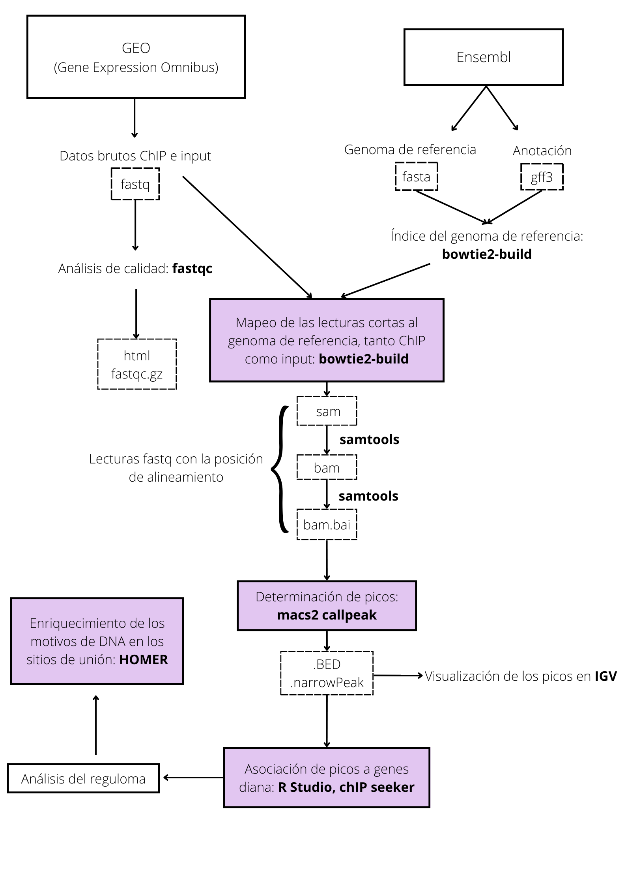
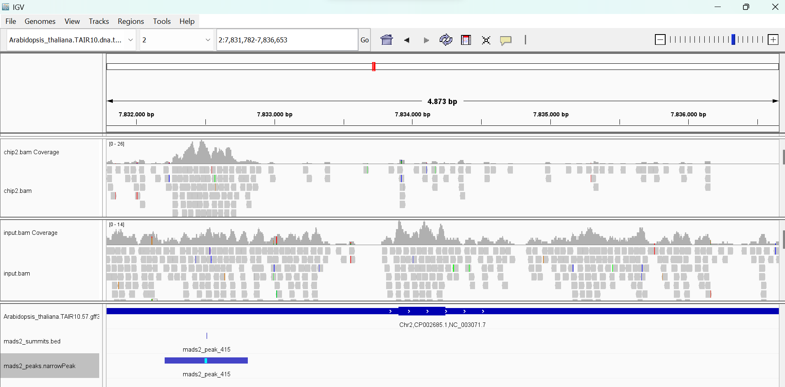
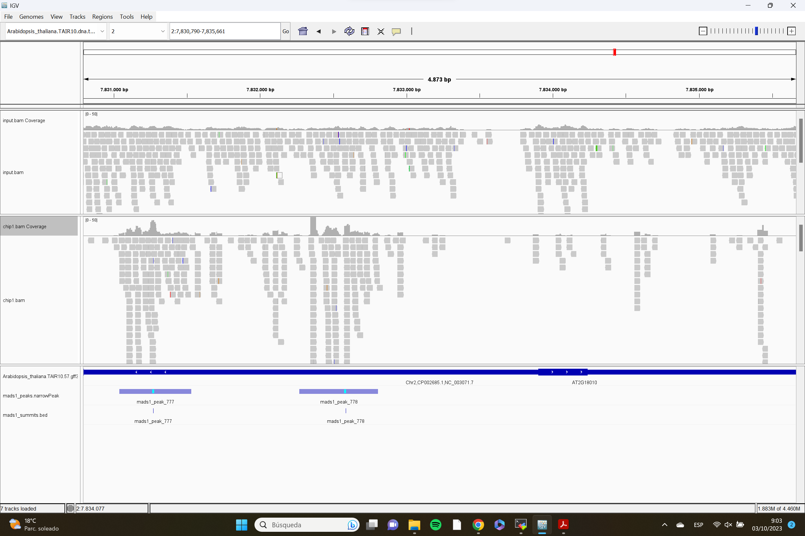

---
output:
  word_document: default
  html_document: default
---
```{r setup, include=FALSE}  

knitr::opts_chunk$set(warning = FALSE, message = FALSE)  

``` 

---
output:
  word_document: default
  html_document: default
---
# FRUITFULL controla la expresión de SAUR10 y regula el crecimiento y la arquitectura de Arabidopsis

#### Autores: Marta Escalante Berraquero, Isabel Lunisa Felipe, Isabel Martín Yot, Julio Rodrigo Quiros, Beatriz Rojo Arce

## Introducción
### Antecedentes
Las plantas que posean el mismo genotipo pueden mostrar distinto fenotipo si han crecido en condiciones distintas, como puede ser diferentes temperaturas o condiciones lumínicas. Esto se debe a un equilibrio entre los factores internos, distintos factores de transcripción que se van expresando oportunamente y regulando el programa de crecimiento y desarrollo; y factores externos medioambientales. Las respuestas a estos últimos se dan principalmente a nivel de vías hormonales, destacando las auxinas, giberelinas o brasinoesteroides.  

En este artículo (Bemer et al., 2017) se centran en estudiar la interacción entre **el factor de transcripción FRUITFULL** con el genoma, especialmente con una diana, la **familia de genes SAUR** (pequeños RNA regulados por auxinas), que integra respuestas tanto por vías hormonales como por vías de desarrollo. Por un lado, estos genes aumentan su transcripción al añadir auxinas al medio y se encargan de fomentar la elongación celular por la teoría del crecimiento ácido, donde se promueve la activación de las ATPasas de H+ y, por tanto, se consigue la acidificación de la membrana que resulta en una elongación de la célula. Por otro lado, los genes SAUR también son diana de numerosos factores de transcripción, especialmente de la familia de **factores de transcripción de dominio MADS**, involucrados en el desarrollo de la planta. Así pues, se llegó a la conclusión de que los reguladores de crecimiento de la familia SAUR actúan como integradores de las vías de desarrollo y de factores ambientales.   

### Objetivo
Se estudió el factor FRUITFULL, de dominio MADS, del cual se conocía su importancia en el desarrollo del fruto, pero se sospechaba que podía tener funciones adicionales en el crecimiento de la planta, regulando genes involucrados en elongación mediada por hormonas o por luz. 

Se realizó un experimento de **ChIP-Seq** con el factor de dominio MADS FRUITFULL en *Arabidopsis thaliana* para analizar la distribución global de su cistroma, es decir, de todos los sitios de unión de este factor al ADN. A partir de esto, se estudia el reguloma, que es el conjunto de genes que son regulados por este factor y que va a servir para descubrir los procesos fisiológicos enriquecidos en los que el factor FRUITFULL está involucrado. Este estudio permitirá confirmar la hipótesis sobre las funciones de este factor de dominio MADS en la expresión de SAUR10 y otros genes relacionados con el crecimiento y el desarrollo de la planta. Asimismo, se podrá demostrar que SAUR10 es un ejemplo de integrador de señales de las vías de desarrollo y de las ambientales. 


## Materiales y Métodos

### Diseño Experimental
Para la realización del análisis ChIP-seq fueron recogidos tejidos del pistilo de *Arabidopsis thaliana*, basándonos en el estudio del artículo de Bemer et al. (2017) publicado en la base de datos [PubMed](https://www.ncbi.nlm.nih.gov/pmc/articles/PMC5853401/).

El diseño experimental que se va a seguir para hacer el análisis cistrómico está recogido en el repositorio [NCBI GEO](https://www.ncbi.nlm.nih.gov/geo/query/acc.cgi?acc=GSE79554) bajo el número de acceso **GSE79554**. 

Las condiciones y muestras usadas en el estudio son las siguientes:    

  * 2 réplicas de *Arabidopsis thaliana* de ecotipo Columbia-0 y background mutante en ful-1. Son una línea FUL-GFP pues se ha realizado un ChIP con anticuerpo GFP que se va a unir a los sitios de unión del factor FRUITFULL (FUL) con el ADN. Usamos dos réplicas:   

    + Chip1   

    + Chip2   
    
* 2 réplicas de *Arabidopsis thaliana* de ecotipo Columbia-0 y background mutante en ful-1. Estas sirven como control ‘input’, que consiste en una desviación en el estudio ChIP, pues solo se fragmenta y no se añade ningún anticuerpo. De esta forma obtendremos la distribución esperada del fondo. Igualmente, usamos dos réplicas:    

    + Input1   

    + Input2   


### Flujo de trabajo
Para llevar a cabo el procesamiento de las muestras accedemos al terminal del superordenador del CICA, dentro de la división MolSysBio, a través de una sesión SSH utilizando la herramienta MobaXterm. Los pasos a seguir vienen reflejados en el esquema del flujo de trabajo. 

 

A partir del estudio elegido, **descargamos las muestras** de Gene Expression Omnibus (GEO) en formato fastq, que contiene los datos brutos de las condiciones ChIP e input, siendo esta última la que actúa como control. Por otro lado, **descargamos el genoma de *Arabidopsis thaliana* y la anotación** de Ensembl Plants en formatos fasta y gff3, respectivamente. Creamos el **índice del genoma** de referencia utilizando la función **bowtie2-build**, ya que el genoma completo es demasiado grande como para utilizarlo directamente en el mapeo de las lecturas. Para asegurarnos que las muestras presentan las características apropiadas, se realiza un **análisis de calidad** de cada una de ellas con la función fastqc, que nos devolverá el resultado del análisis como ficheros html y fastqc.gz.  


Tras haber comprobado la correcta aptitud de las distintas muestras, se lleva a cabo el **mapeo de las lecturas cortas sobre el genoma de referencia**, usando bowtie2-build. Hacemos esto tanto con las muestras input como las muestras ChIP, realizando por tanto hasta 4 mapeos. Inicialmente, el mapeo de las distintas lecturas se almacena en un fichero en formato sam, que ocupa mucho espacio, así que con la función samtools vamos a transfomar dicho fichero en formato bam. A continuación, se construye un índice del fichero bam con la misma herramienta ya utilizada, samtools, de modo que obtenemos un nuevo fichero con extensión bam.bai de tamaño reducido. Hasta aquí el procesamiento era idéntico en ambas condiciones, sin embargo, ahora diferenciaremos entre los ficheros procedentes de las muestras ChIP y los procedentes de input. Estos últimos serán combinados en un único fichero bam, pues actúan de control negativo, gracias a la función **merge**. Los ficheros bam procedentes de las dos muestras ChIP, en cambio, no se unirán con merge, ya que ahora vamos a determinar los picos comparando el número de lecturas de nuestras muestras ChIP con la de la muestra input y, por contraste de hipótesis, solo se considerarán picos aquellas lecturas donde esté estadísticamente enriquecido frente a input. Esto será implementado con la función **macs2 callpeak**. Obtendremos diversos ficheros, donde destacamos dos, que tienen formato .BED y .narrowPeak y nos servirán para el análisis. El archivo .BED contiene información sobre la cumbre de cada pico, mientras que el .narrowPeak veremos distintas informaciones sobre el pico en sí. 

Para comprobar que se ha hecho correctamente, usamos los ficheros .BED y .NarrowPeak resultantes y visualizamos los picos en IGV. No obstante, hemos enfrentado ambas muestras ChIP al input, así que tenemos dos ficheros distintos con picos distintos. Como trabajamos con condiciones que tienen más de una muestra sería muy complicado interpretar esto, nos interesa tener la intersección de los picos de ambas muestras, es decir, aquellos picos que se encuentran tanto en el fichero resultante de enfrentar ChIP 1 con input como en el resultante de enfrentar ChIP 2. Realizamos esto con **bedtools intersect**, y obtendremos nuestro archivo final .narrowPeak. Posteriormente, pasamos al análisis del reguloma en **Rstudio** usando el paquete **chIPseeker**, donde asociaremos picos a genes diana utilizando el método del gen más cercano aguas abajo o nearest downstream gene (NDG), que consiste en asignar el gen diana asociado a un pico como el más cercano aguas abajo. Finalmente, gracias a la herramienta **HOMER**, buscamos motivos de 8pb enriquecidos en los datos genómicos que tenemos en los ficheros .BED 


## Resultados 

### Análisis de la distribución global del Cistroma 

Como se ha comentado en el apartado anterior, los ficheros .narrowPeak y .Bed obtenidos en la determinación de picos contienen diferente información sobre los mismos. Podemos utilizar la herramienta RStudio para analizar el cistroma o conjunto de regiones cis donde se une el factor de transcripción estudiado. Para ello, leemos el fichero .narrowPeak en R usando la función **readPeakFile** y guardamos el resultado en una variable (mads.peaks). Para saber el número picos y, por ende, de sitios donde se une el correspondiente factor, extraemos la columna que contiene el identificador de cada pico (columna V4) y aplicamos la función length.  

```{r} 

library(ChIPseeker) 

library(TxDb.Athaliana.BioMart.plantsmart28) 

txdb <- TxDb.Athaliana.BioMart.plantsmart28 

mads.peaks <- readPeakFile(peakfile = "mads_peaks.narrowPeak", header=FALSE)

identificador.picos <- mads.peaks$V4

length(identificador.picos) 


``` 

Con ello descubrimos que el número regiones cis es de 930. No obstante, conviene aclarar que esto no quiere decir que en las 930 regiones en las que se está uniendo FRUITFULL esté actuando como regulador de la expresión de genes. Más adelante aclararemos este aspecto. 

Para visualizar los picos hallados usamos la **herramienta IGV (Integrative Genomics Viewer)**. En concreto, nos interesamos en la visualización de picos cercanos al gen AT2G18010 (SAUR10), dado a que entre los objetivos del estudio está el demostrar la regulación que ejerce el factor FRUITFULL en la expresión del gen SAUR10. A continuación, se muestra una imagen del resultado obtenido.  

  

La línea de color azul en la parte inferior de la imagen corresponde al gen SAUR10. Podemos observar que el gen se encuentra en la hebra directa, pues las flechas ubicadas sobre la línea azul indican la dirección de lectura del gen, es decir, de izquierda a derecha. Esto significa que el promotor del gen se situaría a la izquierda del mismo y, como se puede observar, justo en esa posición se ha encontrado un pico en el fichero narrow.Peak. Es decir, se ha detectado un pico correspondiente al factor de transcripción FRUITFULL ubicado en el promotor del gen SAUR10, por lo que es bastante probable que el factor esté actuando como regulador de la expresión del mismo. Con los ficheros chip2.bam Coverage e input.bam Coverage, podemos observar las lecturas registradas en ambas muestras y que plasman la gran cantidad de lecturas halladas en la muestra chip en comparación con el input, lo que indica que existe evidencia de que el factor de transcripción se una a esa región del genoma y, por ello, se asigna el pico. 

A continuación, podemos ver otra imagen donde se muestra otra de las regiones del genoma donde se une el factor de transcripción FRUITFULL. En concreto, se representan dos sitios de unión que igualmente parecen estar ubicados en la región promotora de un gen. Por tanto, es probable que FRUITFULL también se encuentre regulando la expresión de este otro gen.  

 

Como comentamos anteriormente, el que FRUITFULL se una a 930 regiones en el genoma no implica que esté actuando como regulador de genes en todas ellas. Lo más lógico es pensar que actuará regulando la expresión de genes cuando se encuentre cerca de ellos, es decir, cuando se encuentre en la región promotora. Nos interesará entonces conocer la proporción de sitios de unión localizados en la región promotora. 

De nuevo, usamos Rstudio para la representación de la distribución de los picos sobre las distintas estructuras génicas. Definimos la región promotora, lo cual se hace mediante la función **getPromoters**, y realizamos la asignación de los picos a genes siguiendo el método NDG mediante la función **annotatePeak**.   

```{r} 

promoter <- getPromoters(TxDb=txdb,  

                         upstream=1000,  

                         downstream=1000) 

mads.peakAnno <- annotatePeak(peak = mads.peaks,  

                             tssRegion=c(-1000, 1000), 

                             TxDb=txdb) 

``` 
Con esto ya pudimos analizar la localización de los picos del factor de transcripción visualizándolos con diferentes gráficos que se presentan a continuación. 

```{r} 

plotAnnoPie(mads.peakAnno) 

plotAnnoBar(mads.peakAnno) 

plotDistToTSS(mads.peakAnno, 

              title="Distribution of genomic loci relative to TSS", 

              ylab = "Genomic Loci (%) (5' -> 3')") 

```             

Los dos primeros gráficos muestran los mismos resultados representados de diferente forma. El primero es un **pie chart** y el segundo un **bar plot**. Ambos gráficos muestran la distribución de las regiones del genoma donde se han localizado picos. En ellos podemos ver que, prácticamente la mitad de los picos, se localizan en la zona del promotor (50,32%). Otros muchos de ellos se encuentran en regiones distales intergénicas (38,71%), y el resto en otras localizaciones minoritarias. Sin embargo, como ya hemos mencionado, los resultados más relevantes corresponden únicamente a los picos ubicados en la zona del promotor, pues serán los que probablemente estén actuando como reguladores de genes por ser los más cercanos a ellos. Es decir que, de los 930 picos identificados, la mitad de ellos se encontrarían regulando genes. 

Por otro lado, en el tercer gráfico podemos estudiar la **distancia de los picos al sitio de inicio de la transcripción (TSS)**. La línea negra vertical separa los picos que se localizan en la hebra codificante, ubicados a la derecha de la misma, de los picos que se encuentran en la hebra inversa, a la izquierda. En conjunto, de nuevo podemos concluir que, aproximadamente el 50% de los picos, se encuentran a una distancia de entre 0-1000 pb del TSS, lo cual coincide con los resultados comentados en los dos gráficos anteriores ya que a esa distancia es donde se localizan los promotores. 

En definitiva, estos resultados nos llevan a la conclusión de que un 50% de los picos correspondientes al factor de transcripción están actuando como reguladores de genes. 

### Análisis del Reguloma del correspondiente factor de transcripción o marca epigenética. 
El reguloma corresponde al conjunto global de genes regulados por un factor de transcripción. Por tanto, en este paso nos centramos en estudiar el conjunto de genes que se encuentran regulados por el factor FRUITFULL. Como hemos adelantado en el apartado anterior, FRUITFULL estará regulando la expresión de genes cuando se una al promotor de los mismos. Para identificar los picos que se encuentran en esta zona, extraemos de la variable **mads.peakAnno** solo los correspondientes a esa región. Para esto es necesario realizar previamente una conversión de la anotación a data frame.  
```{r} 

mads.annotation <- as.data.frame(mads.peakAnno) 

target.genes <- mads.annotation$geneId[mads.annotation$annotation == "Promoter"] 

length(target.genes) 

write(x = target.genes,file = "mads_target_genes.txt") 

``` 
Con la función length podemos observar que el número de picos en la región promotora corresponde a 468. Es decir, FRUITFULL estará regulando la expresión de 468 genes. 

El resultado obtenido acerca de los genes que están siendo regulados por el factor se almacena [en el fichero](mads_target_genes.txt) 

Estos hallazgos son congruentes con los resultados obtenidos en el apartado anterior, donde veíamos que aproximadamente el 50% de los picos se localizaban en la región promotora, ya que 468 es prácticamente la mitad de 930. 

Por tanto, concluimos que, de todos los genes identificados, aproximadamente el 50% de ellos son los que presentan regulación por parte del factor de transcripción FRUITFULL. 


### Enriquecimiento génico
A continuación, realizamos un análisis del enriquecimiento funcional del reguloma con RStudio, de esta forma observamos si hay procesos biológicos enriquecidos regulados por los genes que están regulados por este FT. Para ello cargamos en primer lugar los paquetes **clusterProfiler** y **org.At.tair.db**.  Usamos la función **enrichGO**, en la que especificaremos los genes de interés (target.genes), la base de datos del organismo del estudio (org.At.tair.db, Arabidpsis thaliana), el tipo de ontología de genes (BP, procesos biológicos), el método de ajuste y el p-valor: 

```{r} 

library(clusterProfiler) 

library(org.At.tair.db) 

mads.enrich.go <- enrichGO(gene = target.genes, 

                           OrgDb         = org.At.tair.db, 

                           ont           = "BP", 

                           pAdjustMethod = "BH", 

                           pvalueCutoff  = 0.05, 

                            

                           keyType = "TAIR") 
```

A continuación, hacemos los gráficos llamados **barplot** y **dotplot** del enriquecimiento para poder observar los genes más enriquecidos en relación a los procesos biológicos en Arabidopsis thaliana: 
Este apartado solo es aplicable si estudias un factor de transcripción. 

```{r} 
barplot(mads.enrich.go,showCategory = 10) 

dotplot(mads.enrich.go,showCategory = 10) 
```

En el dotplot podemos observar como el tamaño de los círculos varía según el número de genes que estén implicados en esa función biológica. En el eje X de la gráfica se representa el radio de genes o GeneRatio, el número de genes implicados en cada función biologica dividido por el número de genes total en estudio. Además, se representa en distintos colores el p-valor, siendo los más cálidos un p-valor mayor mientras que los más fríos representan uno menor. En el barplot, en lugar de representar el ratio en el eje x, se representa el número de genes implicados en cada función biológica. Así, se observa cómo se implican un mayor número de genes (24 para cada función) en la regulación de la señalización, de la comunicación celular y de la respuesta al frío. Estos se encuentran seguidos por la regulación del desarrollo post-embrionario (23 genes) y la respuesta a la auxina (22 genes). Encontramos 20 genes implicados tanto en la respuesta celular al alcohol como al ácido abscísico. Por último, encontramos 17 genes para la respuesta celular a los niveles de oxígeno (hipoxia o niveles bajos). 

```{r} 
library(enrichplot)  

emapplot(pairwise_termsim(mads.enrich.go),showCategory = 15, cex_label_category = 0.5) 

cnetplot(mads.enrich.go,showCategory = 7, cex_label_category = 0.5, cex_label_gene = 0.5) 
```
Con la función emapplot podemos visualizar el conjunto de genes enriquecidos como una red, se trazan vínculos entre los grupos de genes enriquecidos lo que facilita su interpretación. De esta forma confirmamos que se implican un gran número de genes relacionados con la comunicación y señalización celular, y además como estos procesos biológicos, junto con la respuesta celular al alcohol y al ácido abscísico están relacionados entre sí. Además, la función cnetplot nos permite observar que genes son los implicados, se representan los distintos procesos biológicos enriquecidos, pero aquí podemos ver los distintos genes que están involucrados en los procesos. 


### Enriquecimiento de Motivos de DNA en los sitios de Unión
**HOMER** es un algoritmo que nos permitirá descubrir motivos diferenciales en el DNA, es decir, analiza dos series de secuencias e identifica los elementos reguladores que están específicamente enriquecidos en nuestro fichero respecto al de referencia. Además, está especialmente optimizado para que el tamaño de estos motivos enriquecidos sea de entre 8 y 20 pb. Para ello utilizaremos el script **findGenomeMotifs.pl**, donde se encuentran todos los pasos para descubrir motivos en regiones genómicas, implementando que el tamaño de los fragmentos para encontrar los motivos sea de 100 pb (es decir, 50 pb a cada lado del centro del pico) y que el tamaño de los motivos sea de 8 pb.  

En resumen, el proceso comienza con la verificación del archivo, que en nuestro caso será el fichero .narrowPeak. Tras extraer las secuencias del genoma correspondientes a las regiones del archivo de entrada, calcula el contenido en GC/CpG de las secuencias de los picos, ya que las islas CpG son las principales fuentes de sesgo a la hora de calcular el contenido de las secuencias y se encuentran cerca del TSS (sitio de inicio de la transcripción). Posteriormente, prepara las secuencias genómicas del tamaño seleccionado (en nuestro caso 100 pb) para que sirvan como secuencias de fondo. Luego selecciona de forma aleatoria otras regiones para que sirvan como background para el descubrimiento de motivos, las cuales serán más del doble en cantidad del número total de picos para mayor fiabilidad de los resultados. Tras una autonormalización para eliminar el sesgo producido por secuencias de oligonucleótidos de menor orden, se comprueba el enriquecimiento primero en motivos ya conocidos y finalmente el descubrimiento de motivos *de novo*.

### Describir y discutir los motivos de DNA conocidos y no conocidos identificados por Homer. 
Respecto al enriquecimiento en motivos de ADN ya conocidos, destacan sin lugar a dudas una gran cantidad de ellos que son específicos de la familia MADS. Esto nos confirma, indudablemente, que el factor de transcripción FRUITFULL es de la familia MADS y nos permite tener bastante confianza en los resultados de los demás motivos, pues, aunque no aporte información nueva, nos asegura que el análisis se ha efectuado de manera idónea. Algunos de estos motivos son el denominado SVP, que se encuentra en el factor de transcripción de nombre homónimo y es también de la familia MADS; el SOC1, descubierto en el factor de transcripción de dominio MADS SOC1; o el AGL6, mismo caso que el anterior. Estos tres factores mencionados están involucrados en el desarrollo del meristemo floral. 

Otros motivos enriquecidos que nos encontramos no relacionados con la familia MADS son, por ejemplo, el sitio de unión del factor de transcripción SPCH al ADN, involucrado en la regulación del movimiento de los estomas; o el del factor BIM2, que participa en la ruta de señalización de la hormona vegetal brasinoesteroide.  

En cuanto al descubrimiento de motivos *de novo*, el que encontramos más enriquecido en los picos es el GTCACGTG, que tiene una similitud clara con los sitios de unión del factor SPCH mencionado anteriormente, por tanto, podríamos inferir que ambos genes se encuentran bastante relacionados estructuralmente. Otro motivo *de novo* es la alternancia de citosinas y timinas, relacionado con las secuencias de promotores de *Arabidopsis thaliana*, en la caja GAGA. Finalmente, también sería reseñable destacar la existencia del motivo GTGGGCCC, presente en factores bHLH como el SPCH (SPEECHLESS). 

Aquí presentamos una tabla con algunos motivos de novo y sus similaridades

| Motivo de novo | Similaridades      | p-valor | 
|----------------|--------------------|---------|
| GTCACGTG       | factor SPCH (bHLH) | 1e-38   |   
| GTGGGCCC       | factor TCP23       | 1e-31   |   
| AAAAAGGA       | AT5G02460          | 1e-21   |   
| ATATGACT       | factor REPLUMLESS  | 1e-15   |   
| CTCTCTAT       | zona GAGA promotor | 1e-13   |   
| GAGTGAAT       | factor STZ         | 1e-11   |   

Aquí adjuntamos la tabla con los distintos motivos ya conocidos.

| Motivo conocido | Nombre       | p-valor |
|-----------------|--------------|---------|
| AXTTXCCXAATTXGG | SVP (MADS)   | 1e-70   |   
| TXCCXTTATTGGG   | SOC1 (MADS)  | 1e-62   |   
| TTXCCXAAAAXGGXA | AGL6 (MADS)  | 1e-57   |   
| CCAAAAATGG      | TAGL1 (MADS) | 1e-55   |  
| TXCCAAAATTGG    | AGL63 (MADS) | 1e-49   |   
| XCACGTGA        | SPCH (bHLH)  | 1e-32   |   
| XTCACGTGXX      | BIM2 (bHLH)  | 1e-29   |   


## Conclusiones
### Relacionar todos los resultados anteriores para formular conclusiones del análisis realizado.
Como ya hemos mencionado anteriormente, nos interesa visualizar el número de picos o regiones cis donde se une el factor de transcripción. Por tanto, nos centramos en el gen AT2G18010 (SAUR10), ya que se pretende demostrar la regulación del factor FRUITFULL en la expresión de aquellos genes relacionados con el crecimiento.  Al visualizar los picos, nos encontramos con uno que corresponde al factor de transcripción FRUITFULL, el cual se encuentra ubicado en el promotor del gen SAUR10. Esto nos lleva a la conclusión de que puede actuar como regulador de este. 

Usando RStudio pudimos comprobar como la mayoría de los picos (50%) se encuentran ubicados cercanos al promotor, actuando como reguladores de genes por ser los más cercanos. Además, al analizar la distancia de los picos al sitio de inicio de la transcripción (TSS), vimos como la mayoría se encontraban a una distancia entre 0-1000 pb del TSS, lo cual concuerda con los resultados anteriores. 

Cuando analizamos el reguloma, observamos que el número total de genes extraídos con el método NDG es de 930 genes, mientras que el número de genes regulados por FRUITFULL es de 468. Esto corresponde a un 50% de los genes, como ya analizamos con RStudio.  

En cuanto al enriquecimiento en motivos de DNA ya conocidos, una gran cantidad son específicos de la familia MADS, confirmando que FRUITFULL también lo es. Encontramos tres factores que se encuentran involucrados en el desarrollo del meristemo floral: SVP, SOC1 y AGL6. Otros motivos no relacionados con esta familia son el del factor BIM2 (ruta de señalización de la hormona brasinoesteroide) o el sitio de unión del factor de transcripción SPCH al DNA (regulación del movimiento de los estomas). 

Analizando los motivos *de novo*, el más enriquecido es el GTCACGTG. Este presenta una gran similitud con los sitios de unión del factor SPCH siendo posible una relación estructural entre ambos. Otro de ellos es la alternancia de citosinas y timinas, relacionado con las secuencias de promotores de *Arabidopsis thaliana*, en la caja GAGA. También destaca la existencia del motivo GTGGGCCC, presente en factores bHLH como el SPCH (SPEECHLESS).

 
### Relacionar los resultados obtenidos con los descritos en el artículo seleccionado.
Mediante la herramienta de Rstudio pudimos comprobar la existencia de un pico que corresponde al factor de transcripción FRUITFULL, el cual se encuentra ubicado en el promotor del gen SAUR10.  

En el artículo demuestran la existencia de esta unión entre FRUITFULL y SAUR10 señalando los picos de interacción y un ensayo EMSA (*gel Electrophoresis Mobility Shift Assay*), un método de detección rápido y sencillo para detectar interacciones entre proteínas y ácidos nucleicos, donde se indica el complejo de unión FUL-DNA de SAUR10.  Encontraron que la sobreexpresión de FUL condujo a un aumento significativo en la expresión de SAUR10. 

El factor SVP encontrado en nuestro análisis pertenece a la familia MADS y presenta el motivo vCArG III, un tipo de CArG-box. Esta caja también aparece en el promotor de SAUR10, gen que también pertenece a la familia MADS. Esto nos indica la correlación que tienen estos genes y el por qué SVP ha aparecido entre nuestros datos. 


### Propón algún experimento que creas oportuno realizar en el laboratorio para validar los resultados obtenidos. 
Para comprobar estos resultados, podemos llevar a cabo experimentos con Arabidopsis Thaliana. Por un lado, podríamos realizar un experimento de silenciamiento, tendríamos como muestras una planta control, la cual no será sometida a ninguna mutación, y por otro lado una planta con una mutación en el gen que codifica para el factor de transcripción FRUITFULL.  Al cultivar ambas plantas en las mismas condiciones, deberíamos observar una diferencia en el crecimiento de la planta. Al no poder codificar este factor de transcripción, no se podría regular la expresión del gen SAUR10 entre otros, desencadenando como consecuencia problemas en procesos biológicos realcionados con el desarrollo de la planta. 

Por otro lado, podríamos hacer el experimento opuesto con una sobreexpresión del gen que codifica para el factor de transcripción que estamos estudiando, obteniendo así un mayor desarrollo en la planta mutada comparándola con el control. 


## Referencias
[Bemer, M., van Mourik, H., Muiño, J. M., Ferrándiz, C., Kaufmann, K., & Angenent, G. C. (2017). FRUITFULL controls SAUR10 expression and regulates Arabidopsis growth and architecture. Journal of Experimental Botany, 68(13), 3391–3403](https://doi.org/10.1093/jxb/erx184)

[Hellman LM, Fried MG. (2007) Electrophoretic mobility shift assay (EMSA) for detecting protein-nucleic acid interactions, Nature Protocols, 2(8), 1849-61](https://www.ncbi.nlm.nih.gov/pmc/articles/PMC2757439/) 

[Lee JH, Yoo SJ, Park SH, Hwang I, Lee JS, Ahn JH. (Feb 15 2007) Role of SVP in the control of flowering time by ambient temperature in Arabidopsis, Genes & Development, 21(4):397-402](https://www.ncbi.nlm.nih.gov/pmc/articles/PMC1804328/?report=reader)

[TAIR -Arabidopsis.org. AT2G22540](https://www.arabidopsis.org/servlets/TairObject?type=locus&name=At2g22540)
